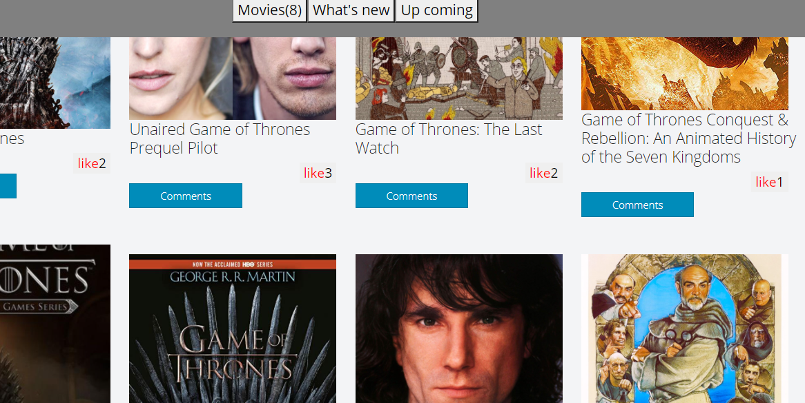

[Microverse](https://img.shields.io/badge/Microverse-blueviolet)

# JavaScript-capstone-project



[Project video](./src/assets/zoom_3.mp4)

The JavaScript capstone project is about building our own web application based on an external API. The webapp have 2 user interfaces:

- A home page showing a list of items that you can "like."
- A popup window with more data about an item that you can use to comment on.
- In this project we pratice giving code reviews to our teammates. 
- We use Jest to test the counters of comments and all items.

### Project requirements
- You should build these interfaces:
  - The *home page*.
  - The *comments popup*.
- You should follow the layout of the wireframes provided. You should personalize the rest of the design including colors, typographies, spacings, etc.
- Home page
  - When the page loads, the webapp retrieves data from rapid API:
    - The Involvement API to show the item likes.
  - When the user clicks on the "Comments" button, the Comments popup appears.
- Comments popup
  - When the popup loads, the webapp retrieves data from:
    - The selected API and shows details about the selected item.
    - The Involvement API to show the item comments.
  - When the user clicks on the "Comment" button, the data is recorded in the Involvement API and the screen is updated.

**Counters**
We have counters that show:
- The number of items (home).
- The number of comments (comments popup).

## Built With 

- HTML/CSS
- JavaSCcript
- Node.JS
- Bootstrap
- Jest

## Getting Started

If you want a copy of this file go to the github repository and download it from the link below.

- [`group-capstone-project`](https://github.com/elisha2kyakpo1/group-capstone-project.git)


#### Setup

```cmd
git clone https://github.com/elisha2kyakpo1/group-capstone-project.git 
cd group-capstone-project
```
### Install

```cmd
npm install
```

```cmd
npm run build 
```
### Usage

```cmd
npm start
```


If you are non a technical person you can download the zip file.

- To do that you have to go to the green button that says 'Code' and then press on it.
- Choose the option 'Download Zip' and wait until it download.
- Then you need to decompress it.
- You will need to have Zip compress file software installed in your computer. If you don't have it you can download it from here
  [`https://www.7-zip.org/download.html`](https://www.7-zip.org/download.html)
- Do double click on the Capstone-1.zip and choose a folder where to place all the decompressed files.
- Once you are done decompressing, you can open the created folder.
- In it you can double click on the index.html file and choose a browser to open it (For example google Chrome Browser).
- Now you should be able to see the project.
- Remember to use the mouse to navigate through the website. Also you can use the keys 'arrow up' and 'arrow down' of your keyboard to scroll up and down.

### Prerequisites

- Node.JS

### Testing
Open the project in your prefered code editor and run the command below.
```
npm test
```
## Author

👤 **Makungong Collins Tatang**

- GitHub: [@CollinsTatang1](https://github.com/CollinsTatang)
- Twitter: [@CollinsTatang1](https://twitter.com/CollinsTatang1)
- LinkedIn: [Makungong Collins](https://www.linkedin.com/in/makungong-collins/)
  
👤 **Elisha Kyakopo**

- GitHub: [@elisha2kyakpo1](https://github.com/elisha2kyakpo1)
- Twitter: [@elisha1k](https://twitter.com/Elisha1k)
- LinkedIn: [Elisha Kyakopo](https://www.linkedin.com/in/elisha-kyakopo/)

## 🤝 Contributing

Contributions, issues, and feature requests are welcome!

Feel free to check the [issues page](../../issues/).

## Show your support

Give a ⭐️ if you like this project!

## Acknowledgments

- Microverse for giving me this chance
- The amazing code reviewers for making me improve every day :thumbsup:
  